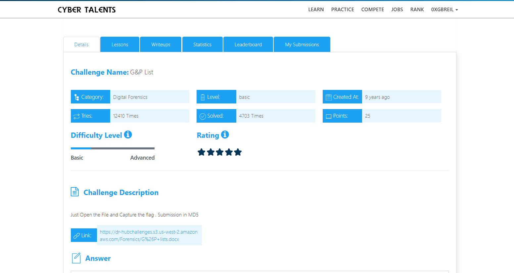
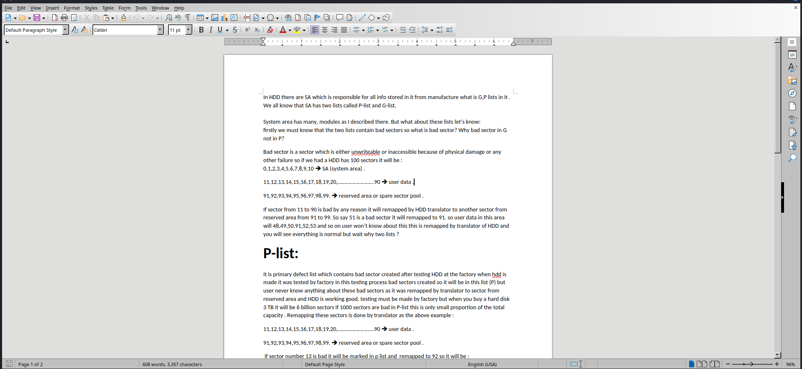
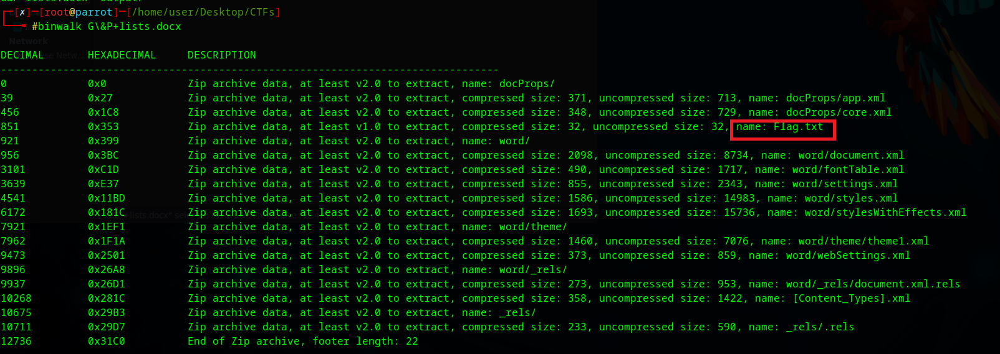
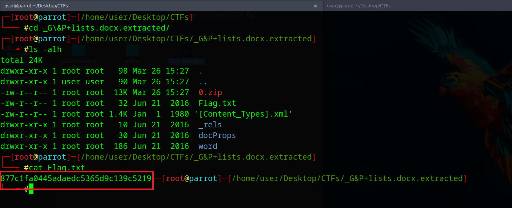

# G&P+lists - Digital Forensics Writeup

## Challenge Description
Just Open the File and Capture the flag. Submission in MD5.

File:
`G&P+lists.docx`



---

## Opening the File
The file was opened using LibreOffice Writer and appeared normal with no visible suspicious content.



---

## Analysis with Binwalk
Since `.docx` files are ZIP archives, I used:

```bash
binwalk G&P+lists.docx

```


## Extracting Files

To extract embedded data:

```bash
binwalk -e G&P+lists.docx

```


## Reading the Flag

```bash
cat Flag.txt

```



Output:

```
877c1fa0445adaedc5365d9c139c5219

```

