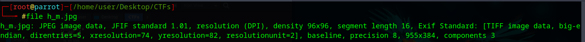
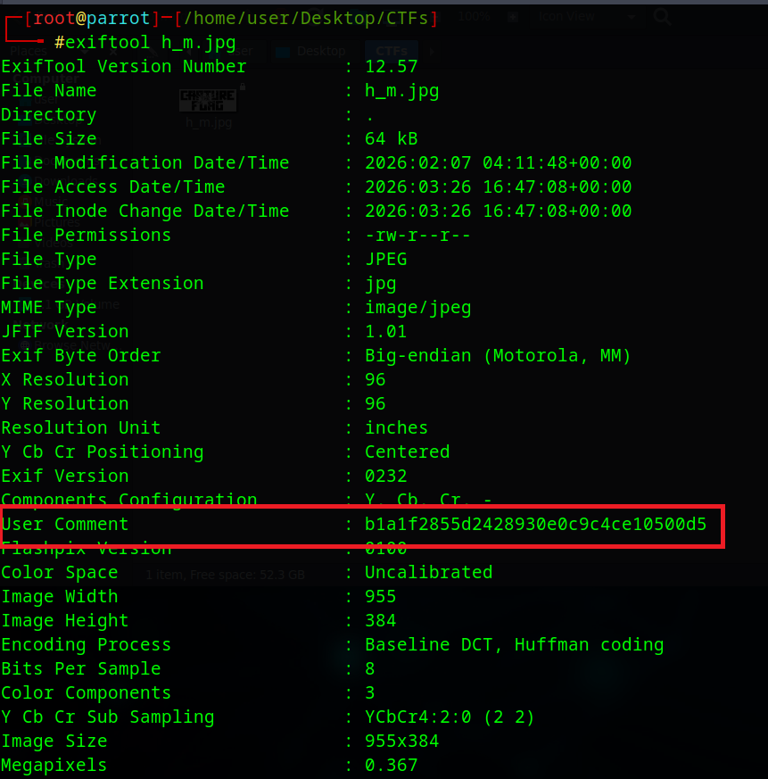
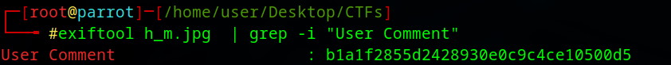

# Hidden Message - Digital Forensics Writeup

## Challenge Description
A cyber Criminal is hiding information in the below file. Capture the flag and submit it in MD5 format.


---

## File Type Identification
To determine the file type, the file was analyzed.



---

## Extracting Metadata
The flag was found using:

```bash
exiftool h_m.jpg 

```


## Extracting the Flag Only

To extract the flag value only:

```

exiftool h_m.jpg  | grep -i "User Comment"

```



## Final Flag

```
b1a1f2855d2428930e0c9c4ce10500d5
```
