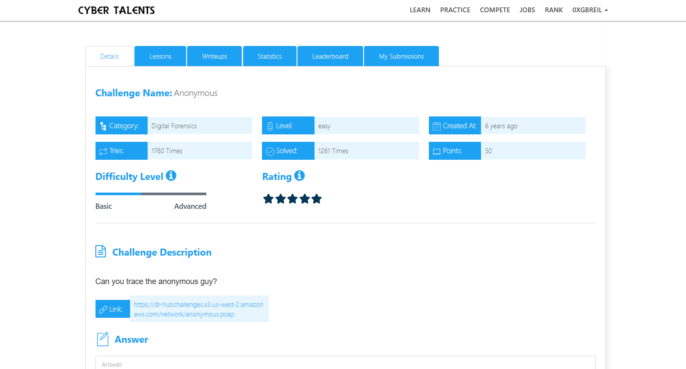
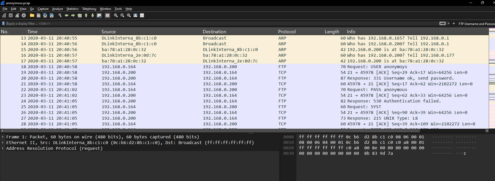
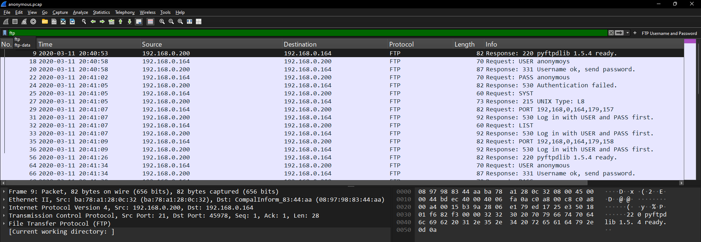
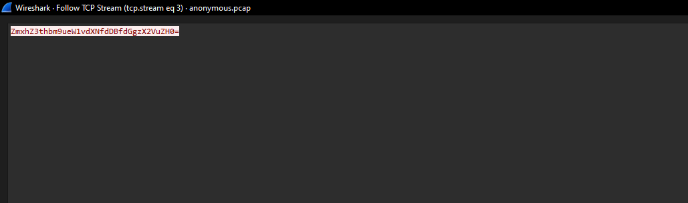
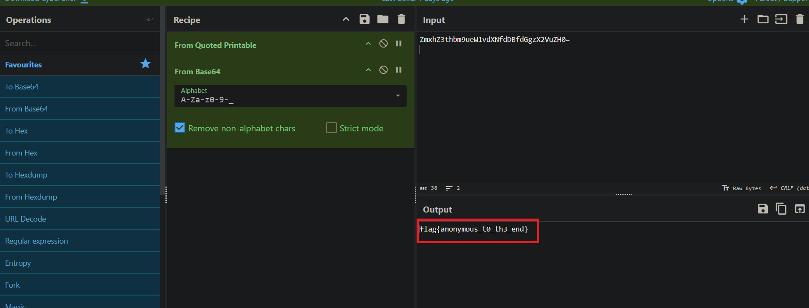
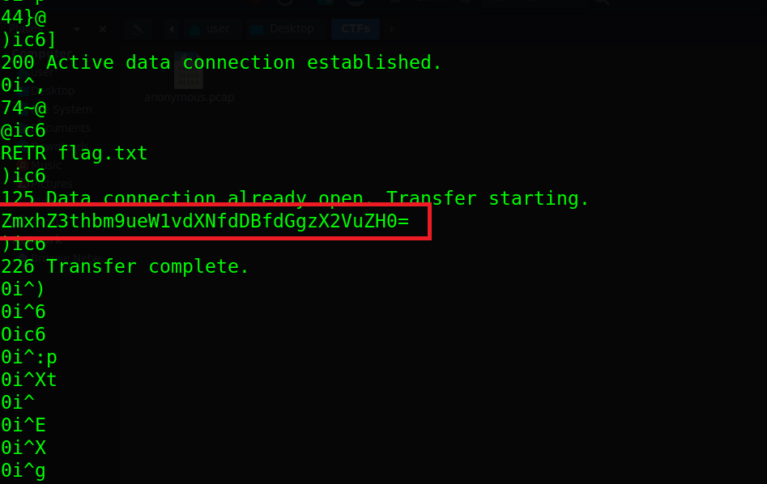

# Anonymous Challenge Description

Can you trace the anonymous guy?



## Overview

Open the PCAP file using *Wireshark*, and you will notice that there are many different protocols.



## FTP Protocol

We can see that there is FTP traffic, so we will use the `ftp` filter.



## Viewing the Packet Content

We will view the packet content using **Follow → FTP Stream**.

We can see the FTP authentication process, then a flag file, and finally some text encoded in Base64.
```bash

ZmxhZ3thbm9ueW1vdXNfdDBfdGgzX2VuZH0=

```



## Decoding Base64 and Getting the Flag

We will decode the text using [CyberChef](https://gchq.github.io/CyberChef/).

After decoding it, the flag will appear.



## Another Way

There is another way to do this by using the `strings` command on the PCAP file. It will show the encoded text.

```bash
strings anonymous.pcap
```


## Final Flag

The Flag is :

```bash

flag{anonymous_t0_th3_end}

```
