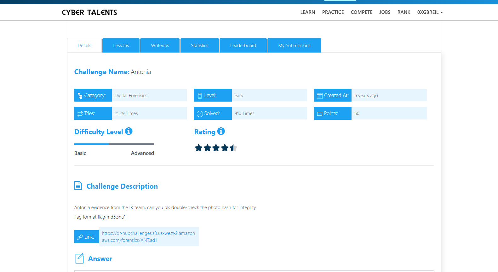
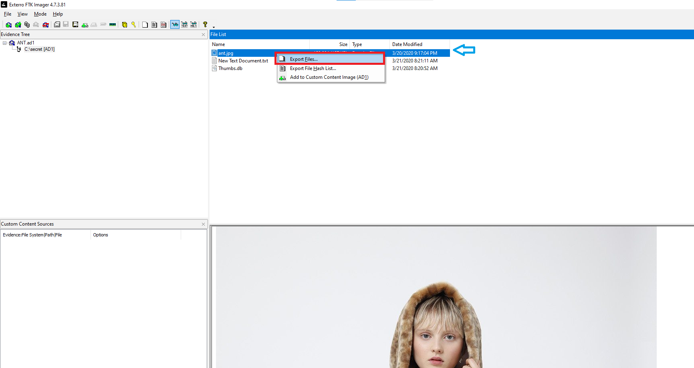
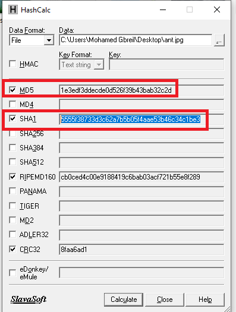

# Antonia Challenge Description

Antonia evidence from the IR team, can you pls double-check the photo hash for integrity 

flag format flag{md5:sha1}



## Overview

We can see that the challenge file has the `.ad1` extension, which is a forensic image format.

We will use a tool like [FTK Imager](https://www.exterro.com/ftk-downloads/ftk-imager-pro-8-2-0-26) to open it.

We can see three files, including the image. Since we need to calculate the hash of the image, we will extract it by double-clicking on it, then selecting **Export File**, and saving it to our computer.



## Calculating the Hash and Getting the Flag

We will calculate the hash of the image. The easiest way is to use a tool like [HashCalc](https://hashcalc.en.download.it/) on Windows.

We only need the **MD5** and **SHA1** hashes because the flag format is:

```text
flag{md5:sha1}
```


## Final Flag

The Flag is :

```bash

flag{1e3edf3ddecde0d526f39b43bab32c2d:5555f38733d3c62a7b5b05f4aae53b46c34c1be3}

```
