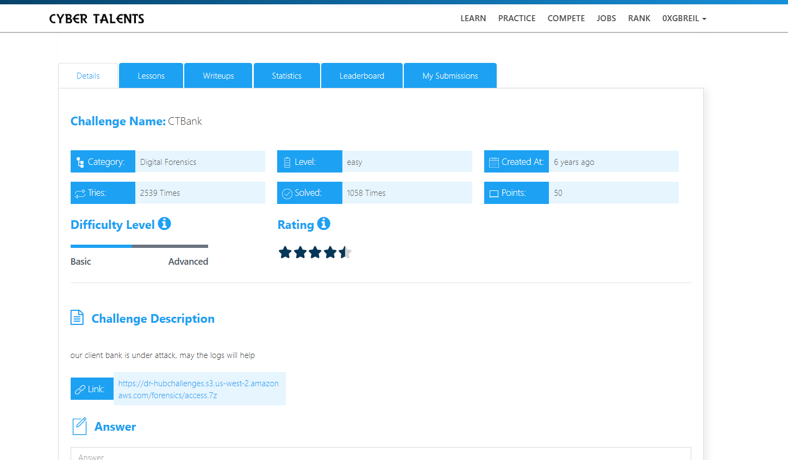
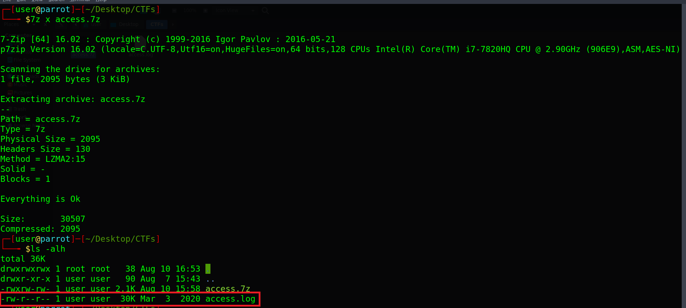
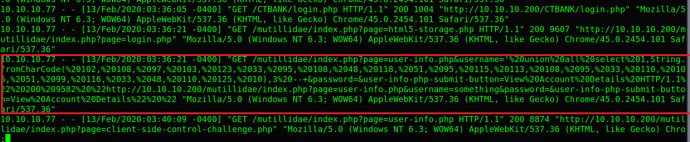
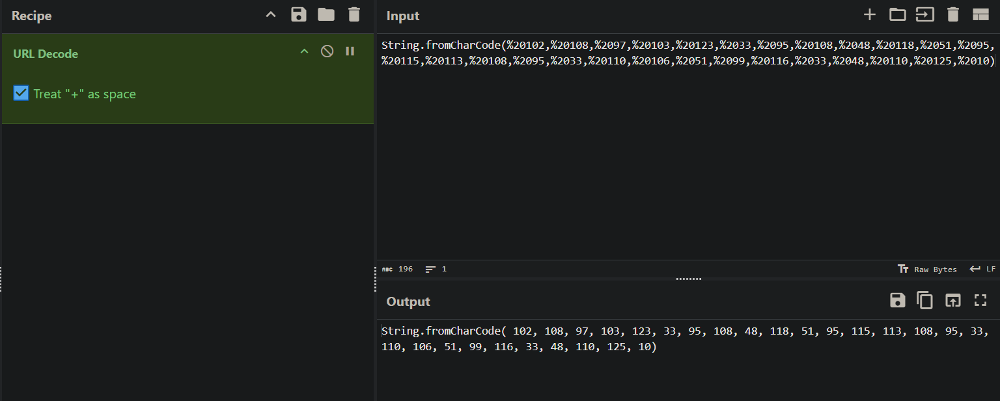
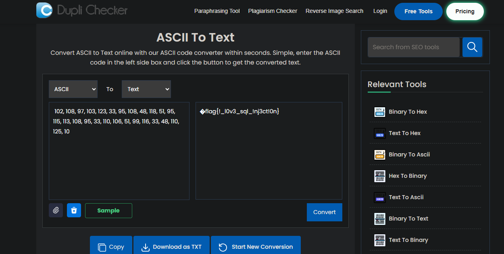

# CTBank Challenge Description

our client bank is under attack, may the logs will help



---

## Overview

We can see that the challenge file is compressed, so we will extract it using the following command:

```bash
7z x access.7z
```

We can see that it contains an `access.log` file, which is a log file that records requests and activity on a web server.



## Analyzing the File


If we take a look at the file using:

```bash
cat access.log | less
```

We will notice some suspicious entries related to potential flag access attempts. Among them, one request stood out:



## URL Decoding

We can see that it is an SQL Injection, and what we need is the **ASCII payload**, which is encoded using URL encoding.

We will decode it using [CyberChef](https://gchq.github.io/CyberChef/).




## ASCII to Text

We can see that the values are ASCII characters, so we will convert them to text using a website like [Duplichecker](https://www.duplichecker.com/ascii-to-text.php).

After converting them, we will get the flag.



---

## Final Flag

The Flag is :

```bash

flag{!_l0v3_sql_!nj3ct!0n}

```
