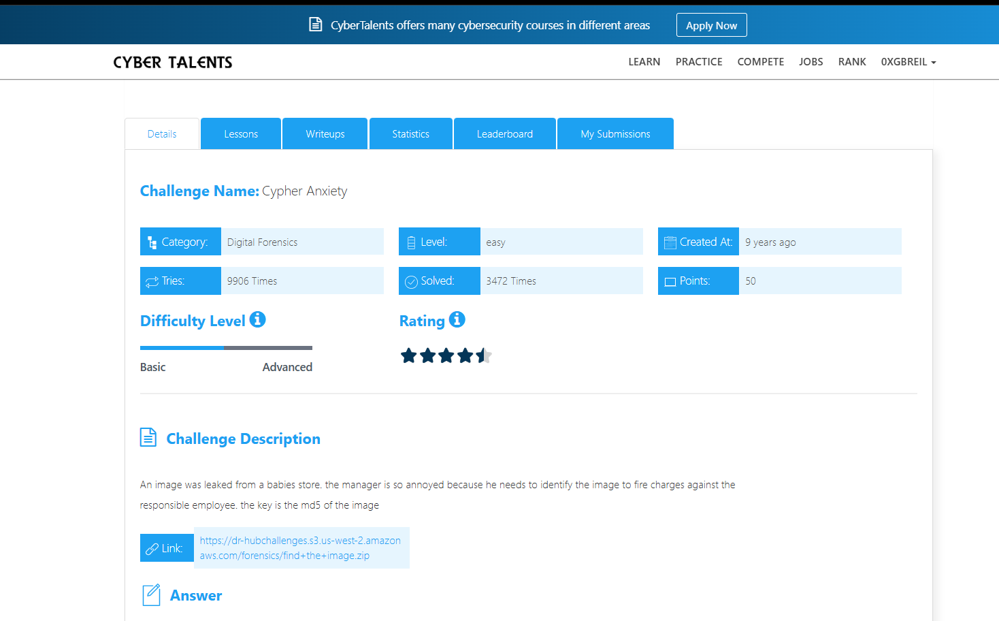
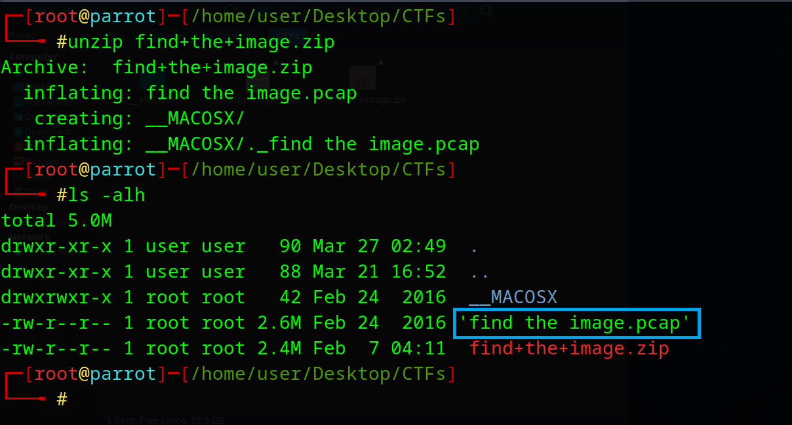
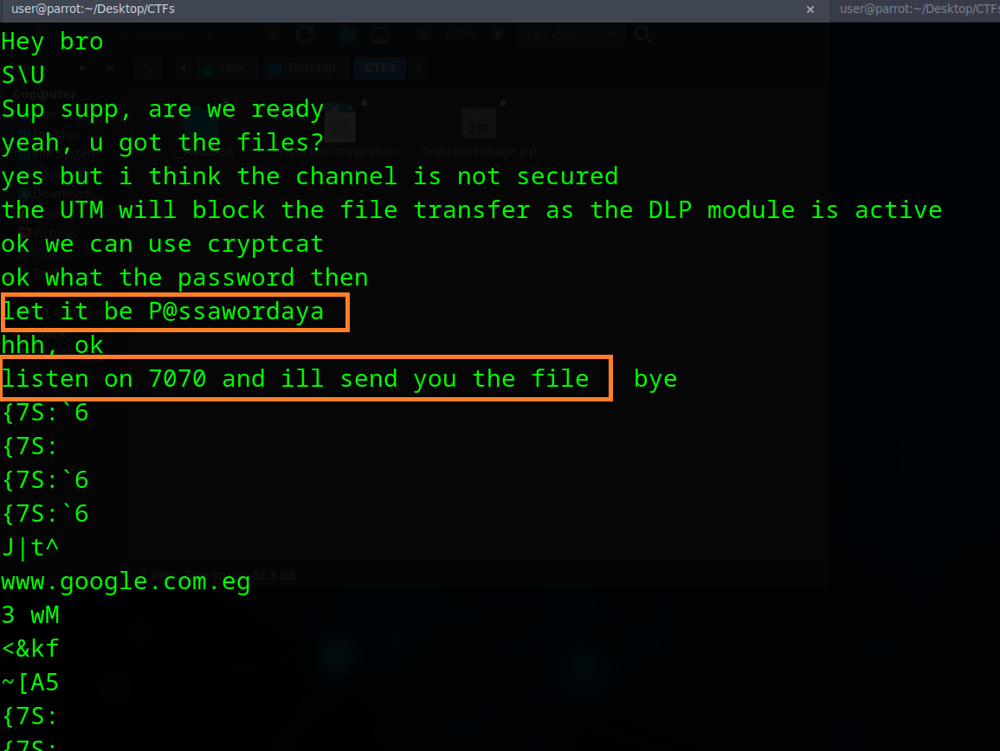
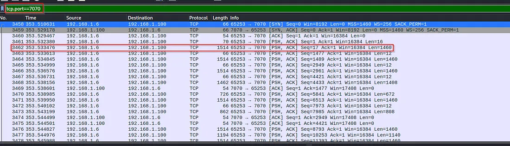
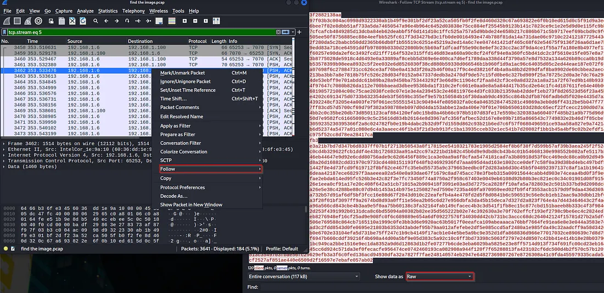
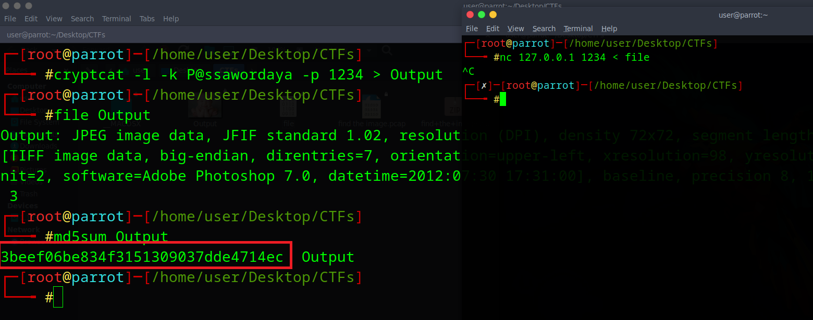

# Cypher Anxiety  Challenge Description
An image was leaked from a babies store. the manager is so annoyed because he needs to identify the image to fire charges against the responsible employee. the key is the md5 of the image



---

## Downloading the File
Start by downloading the provided file, which is a compressed archive. After downloading, extract its contents to get the `.pcap` file.



---

## Initial Inspection
The extracted file is a network capture (`pcap`). To check if there is any readable data inside, the `strings` command can be used:

```bash
strings 'find the image.pcap' | more


```



You will notice that there is a massage for us Tell us that the password for cryptcat description key is P@sswordaya and the port is 7070 in the pcap.

# Analyzing with Wireshark

Open the capture file using Wireshark:

```bash
wireshark -r 'find the image.pcap'
```
Apply the following filter to focus on relevant traffic:

```bash

tcp.port==7070

```

From the filtered packets, inspect the PSH packets since they carry actual data.



## Extracting the Stream

The first PSH packet does not contain useful data because it is part of sequence initialization between the two nodes. The actual data starts from the next packets.

Select a packet with data, then:
Right click → Follow → TCP Stream

Change the format from ASCII to Raw, then save the stream as a raw file.



## Reconstructing the Data

To simulate the original encrypted communication, start a listener using `cryptcat` with the correct key:

```bash
cryptcat -l -k P@ssawordaya -p 1234 > Output
```

Then send the extracted raw file using nc:

```bash
nc 127.0.0.1 1234 < file

```

After a few seconds, stop the connection using CTRL+C. The output file should now be a JPEG image.





## Getting the Flag

Finally, calculate the MD5 hash of the recovered image:

```bash
md5sum Output

```

The resulting hash is the flag :

```bash
3beef06be834f3151309037dde4714ec
```