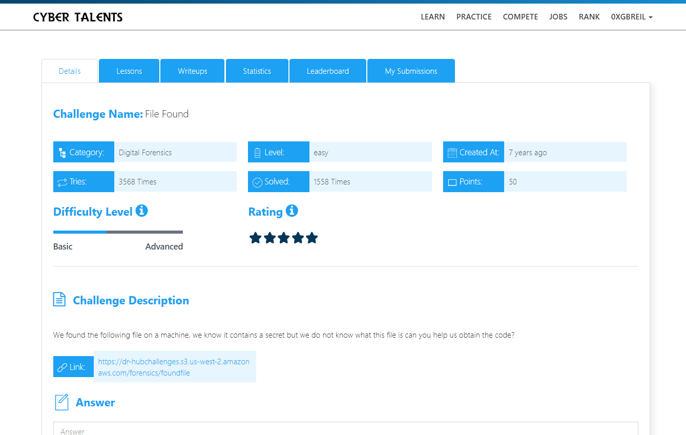
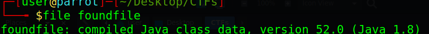
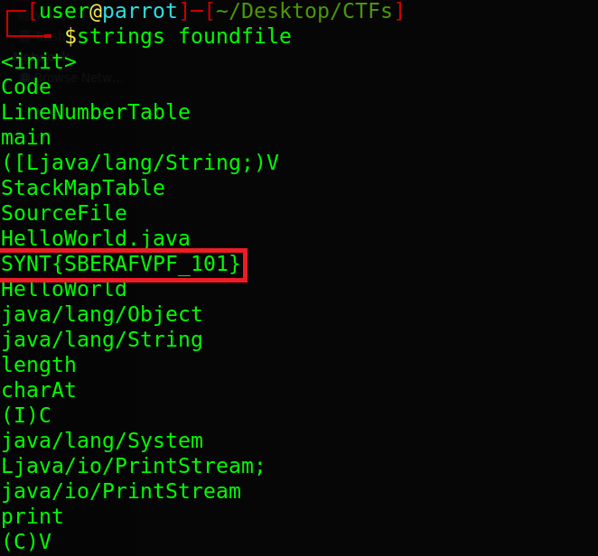
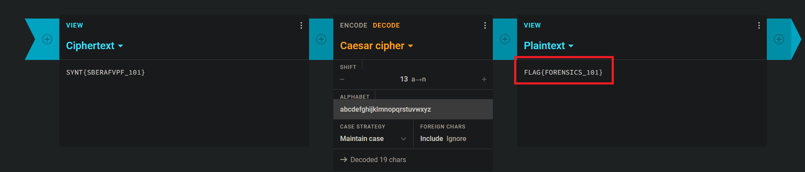
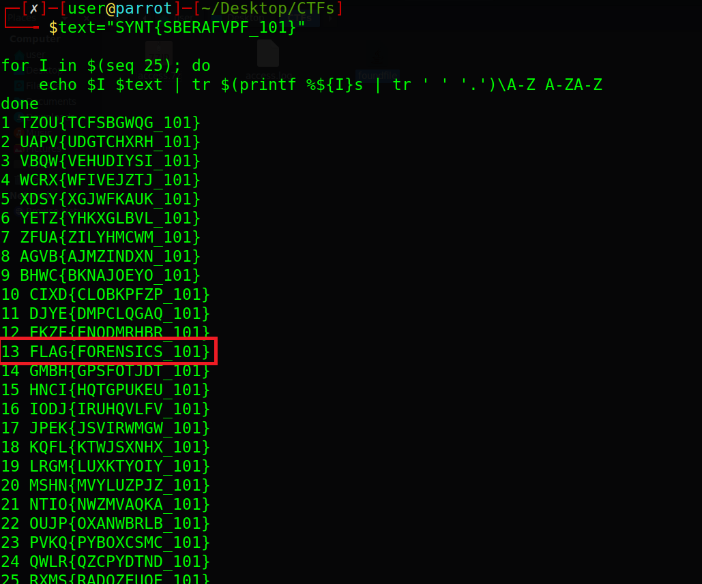

# File Found Challenge Description

We found the following file on a machine, we know it contains a secret but we do not know what this file is can you help us obtain the code?



---

## Identifying the File

First, we check the file type using the `file` command.

```bash
file foundfile
```


## Getting the Readable Text

Next, we use the `strings` command to extract readable text from the file.

```bash
strings foundfile
```

We get the following text:

```text
SYNT{SBERAFVPF_101}
```

This looks like a **Caesar cipher**.




## Decoding the Cipher

We can decode the cipher using an online tool like [Cryptii](https://cryptii.com/pipes/caesar-cipher).

Using key `13`, we get the flag.




### Using Bash

We can also decode it using a Bash script:

```bash
text="SYNT{SBERAFVPF_101}"

for I in $(seq 25); do
    echo $I $text | tr $(printf %${I}s | tr ' ' '.')\A-Z A-ZA-Z
done
```



## Final Flag

The Flag is :

```bash

FLAG{FORENSICS_101}

```


