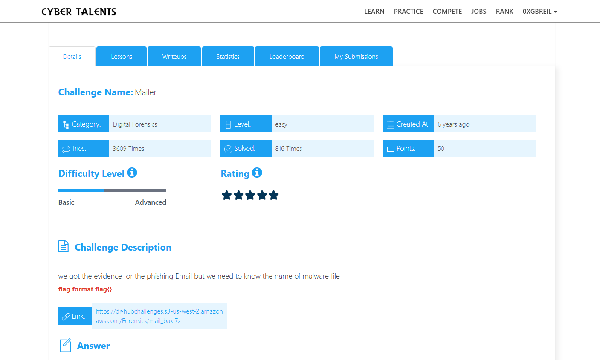
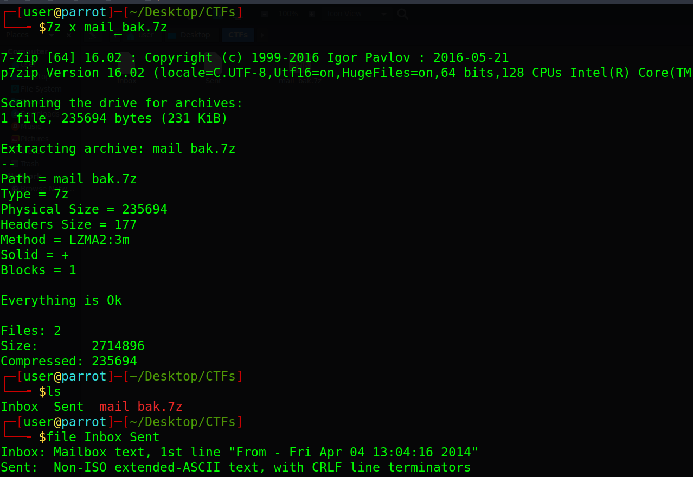
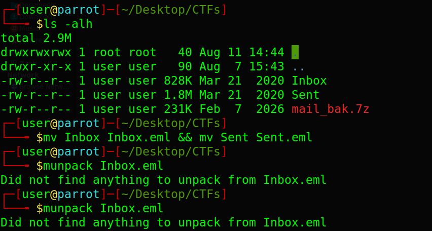
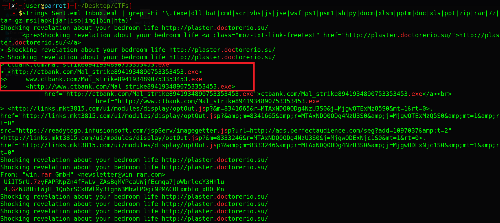

# Mailer Challenge Description

we got the evidence for the phishing Email but we need to know the name of malware file .



---

## Step 1: Identifying the Files

First, we check the file types using the `file` command:

```bash
file Inbox Sent
```

The result shows that `Sent` is a text file, while `Inbox` is an HTML document. Both files contain email-related data.



## Step 2: Viewing the Content

The files are too large to read manually using `cat`, so I renamed them with the `.eml` extension and tried opening them with email viewers like munpack or MailStore Home or Zoho EML Viewer.

However, the content was still messy and the tools could not properly parse the files.



## Step 3: Searching for Suspicious Files

Since the challenge asks for the malware file name, I searched both files for suspicious file extensions using `strings` and `grep`:

```bash
strings Sent Inbox | grep -Ei '\.(exe|dll|bat|cmd|scr|vbs|js|jse|wsf|ps1|psm1|sh|py|docm|xlsm|pptm|doc|xls|ppt|zip|rar|7z|tar|gz|msi|apk|jar|iso|img|bin|hta)'
```

Among the results, this stood out:

```text
ctbank.com/Mal_strike8941934890753353453.exe
http://www.ctbank.com/Mal_strike8941934890753353453.exe
```



## Step 4: Identifying the Malware

We consider this the malicious file because:

1. It is an `.exe` file, which is a common format for Windows malware.
2. The long random-looking number in the filename looks suspicious.
3. The other results were mostly marketing URLs, opt-out links, or spam content.


## Final Flag

The Flag is :

```bash
flag{Mal_strike8941934890753353453.exe}
```
