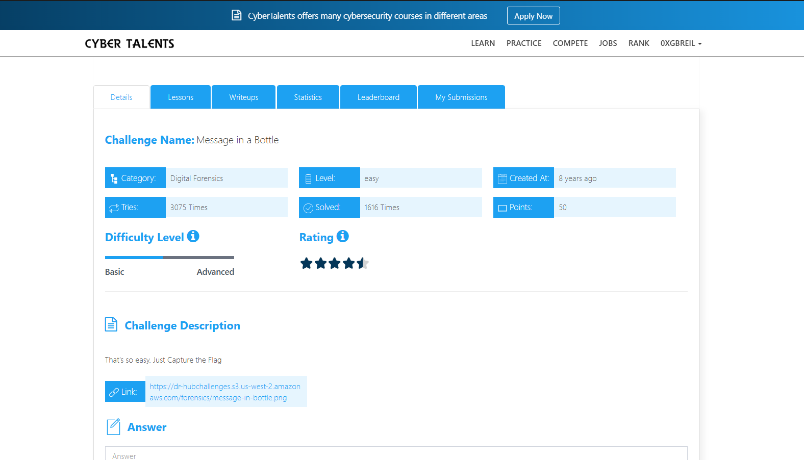
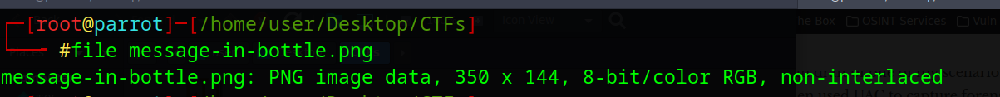
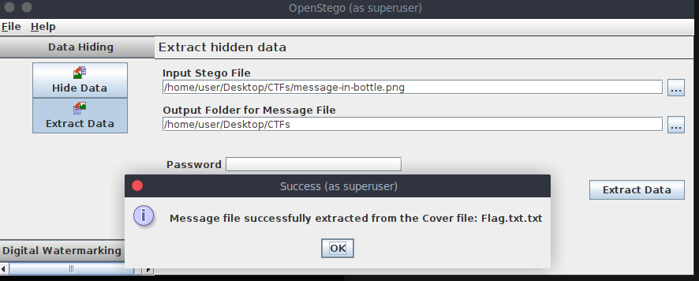
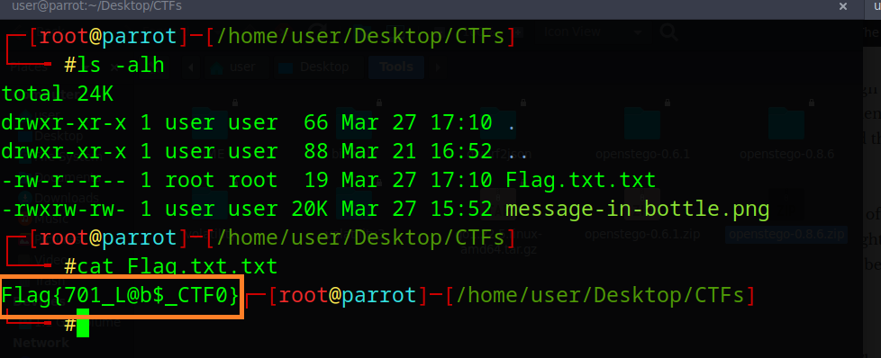

# Message in a Bottle     Challenge Description
That's so easy. Just Capture the Flag



---

## File Identification
To determine the file type, the following command was used:

```bash
file message-in-bottle.png
```



## Steganography Analysis

After multiple attempts to analyze the image, a suitable tool was identified: **OpenStego** (version 0.6.1).

Download link:  
https://github.com/syvaidya/openstego/releases/tag/openstego-0.6.1

This tool was used to extract hidden data from the image.



## Extracting Hidden Data

Load the image into OpenStego, specify the output location, then choose the "Extract Data" option to retrieve the hidden content.



## Final Flag

The Flag is :

```bash
Flag{701_L@b$_CTF0}
```