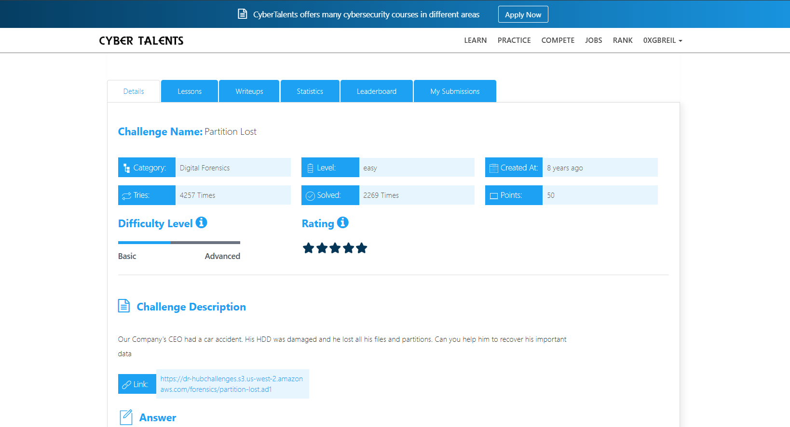
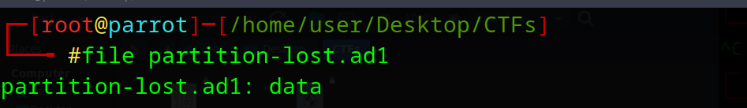
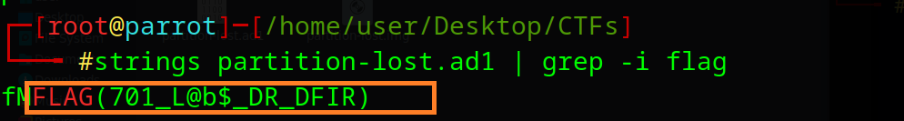
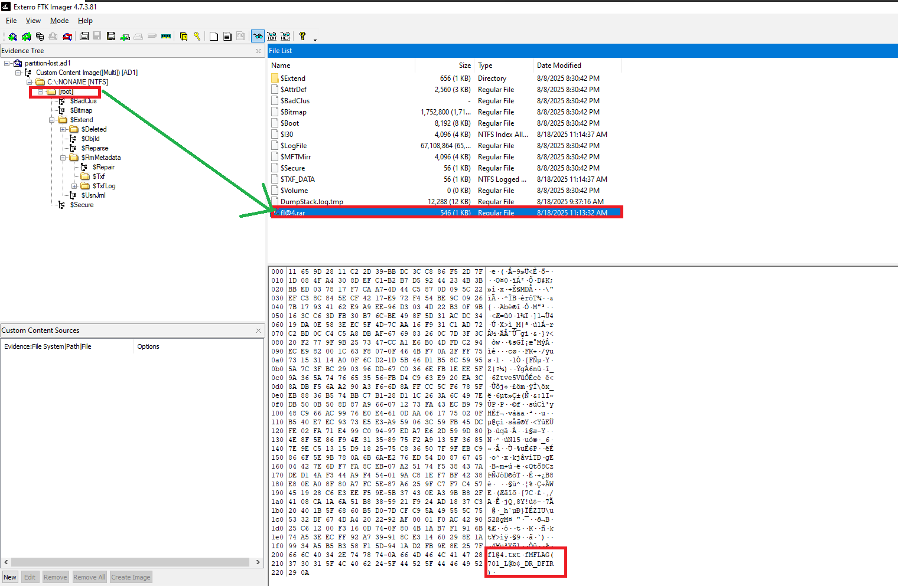

# Partition Lost Challenge Description
Our Company's CEO had a car accident. His HDD was damaged and he lost all his files and partitions. Can you help him to recover his important data



---

## Initial Analysis
After downloading the file, the `file` command was used:

```bash
file partition-lost.ad1
```

The output shows that it is generic data. However, based on the `.ad1` extension, it is actually a forensic image file (AccessData Logical Image) commonly used to store digital evidence in a structured format.

---

## Quick Extraction Method

A simple way to retrieve the flag is by using the `strings` command and filtering the output:

```bash
strings partition-lost.ad1 | grep -i flag

```

The flag can be clearly identified in the output.



---

## Alternative Method

Another approach is to open the file using FTK Imager:

https://www.exterro.com/ftk-downloads/ftk-imager-pro-8-2-0-26

After loading the image, navigate to the root directory where a compressed file named:

`fl@4.rar`

can be found. The flag is located inside this archive.



---

## Final Flag

The Flag is :

```bash

FLAG(701_L@b$_DR_DFIR)

```