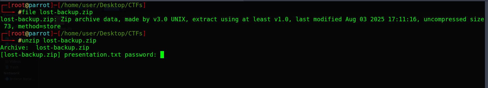
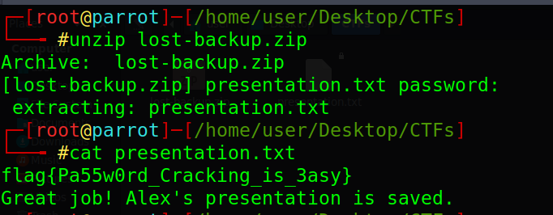

# X-File Challenge Description

someone hiding a secret in this file. can you help me to recover the flag from the secret 


---
## Identifying the File Type and Trying to Open It

We will use the `file` command to identify the file type:

```bash
file lost-backup.zip
```

We can see that it is a ZIP archive.

Then, we try to extract it using:

```bash
unzip lost-backup.zip
```

The archive requires a password.




## Cracking the ZIP Password

We can use `fcrackzip` to crack the ZIP password using a dictionary attack with `rockyou.txt`.

```bash
sudo fcrackzip -D -p /usr/share/wordlists/rockyou.txt -v -u ./lost-backup.zip
```


The password was found:

```text
PASSWORD FOUND!!!!: pw == automotive
```

So, the ZIP password is:

```text
automotive
```


## Getting the Flag

Now we can extract the ZIP file and find the text file containing the flag.

```bash
cat presentation.txt
```



## Final Flag

The Flag is :

```bash

flag{Pa55w0rd_Cracking_is_3asy}

```

