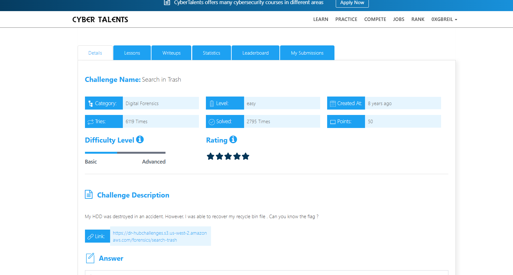
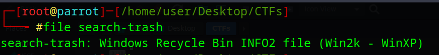
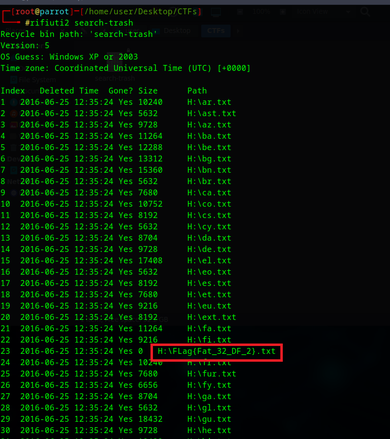
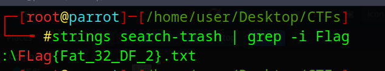

# Search in Trash Challenge Description
My HDD was destroyed in an accident. However, I was able to recover my recycle bin file. Can you know the flag?



---

## File Identification
To determine the file type, the following command was used:

```bash
file search-trash
```
The output shows that it is a Windows Recycle Bin INFO2 file (Windows 2000 / Windows XP).


---

## Analyzing the File

The file was analyzed using the `rifiuti2` tool, which is designed to parse Windows Recycle Bin metadata and extract details about deleted files such as file names, original paths, and timestamps.

```bash
rifiuti2 search-trash
```

During the analysis, a file name was identified that appears to contain the flag.



## Alternative Method

Another way to retrieve the flag is by using the `strings` command:

```bash
strings search-trash | grep -i flag

```



## Final Flag

The Flag is :

```bash

FLag{Fat_32_DF_2}

```