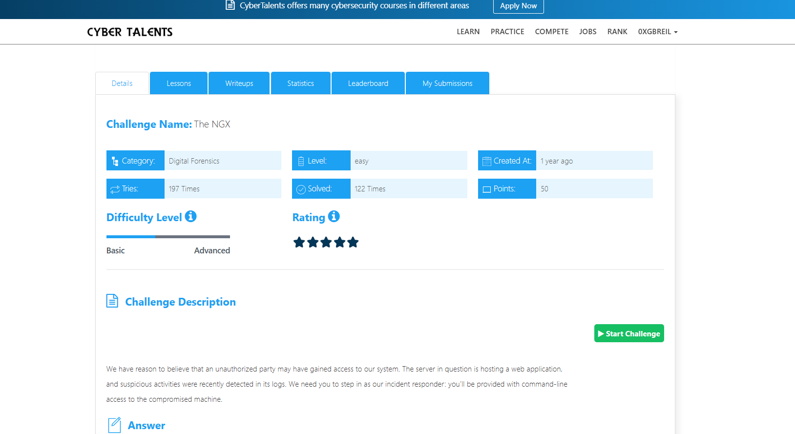
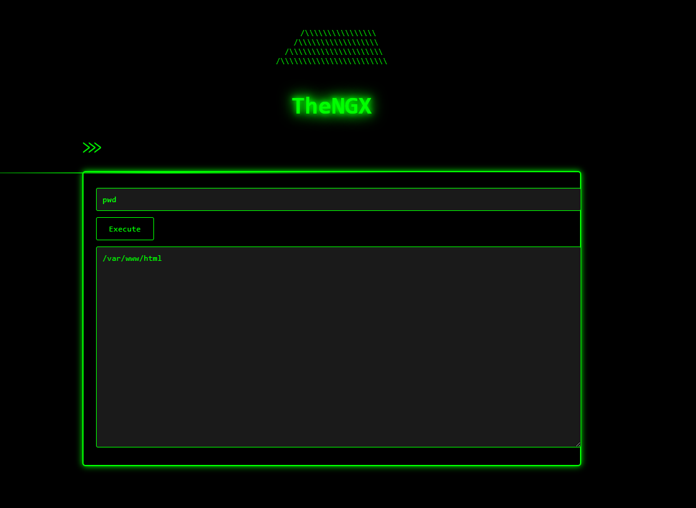
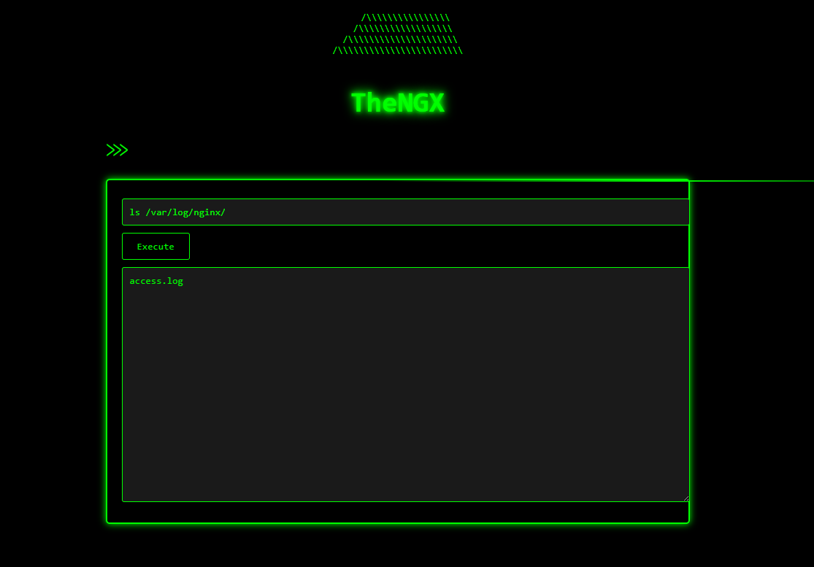
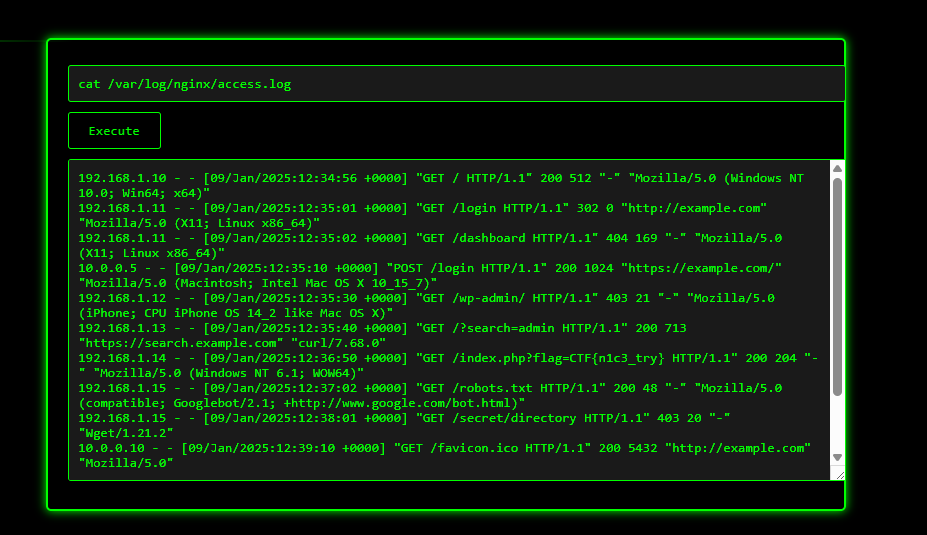
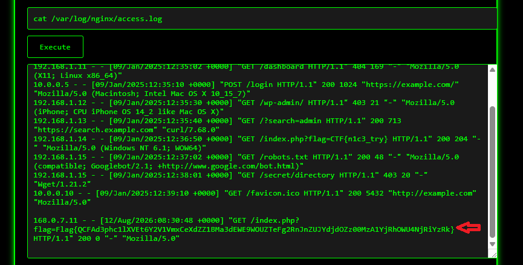

# The NGX Challenge Description

We have reason to believe that an unauthorized party may have gained access to our system. The server in question is hosting a web application, and suspicious activities were recently detected in its logs. We need you to step in as our incident responder: you’ll be provided with command-line access to the compromised machine.



---

# Overview

The challenge is about a server that was compromised, and our goal is to check what happened by analyzing the web server logs. First We will start the machine.

## Finding the Web Server Logs

First, we check the current directory:

```bash
pwd
```


We can see that we are in the website directory. Since the challenge is about **NGINX**, we check its logs:

```bash
ls /var/log/nginx/
```


We find the `access.log` file, so we can start analyzing it.




## Analyzing the Access Log

We can take a look at the access log and see different requests.

The log shows the IP address of the machine accessing the web server, the timestamp, and the requested URL.

We can see requests to the website homepage, the login page, and the dashboard. Some requests also returned errors like `404` and `403`.

```bash
cat /var/log/nginx/access.log
```



## Getting the Flag

If we look at the last record in the log, we can see a `GET` request to `index.php`.

This request contains the flag.



The challenge is pretty simple. It mainly shows that the location of web server logs depends on the type of web server being used, and in this case, the flag was in the last record of the NGINX access log.

---

## Final Flag

The Flag is :

```bash

Flag{QCFAd3phc1lXVEt6Y2V1VmxCeXdZZ1BMa3dEWE9WOUZTeFg2RnJnZUJYdjdOZz00MzA1YjRhOWU4NjRiYzRk}

```

