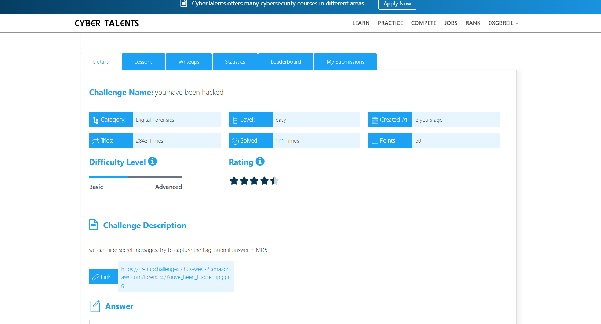
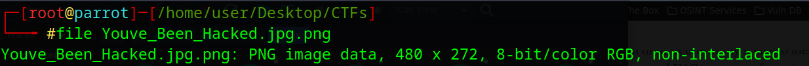
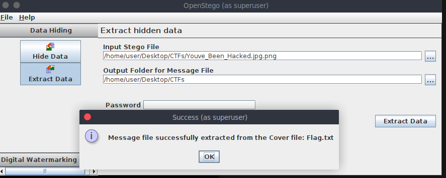
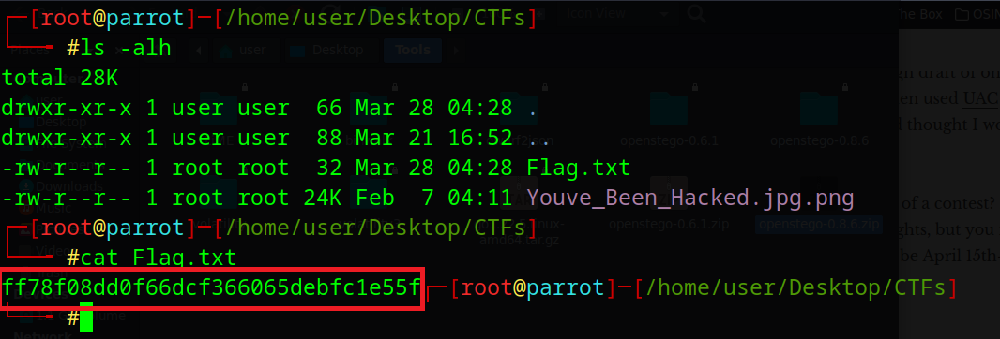

# you have been hacked    Challenge Description
we can hide secret messages, try to capture the flag. Submit answer in MD5



---

## File Identification
The file type can be checked using:

```bash
file Youve_Been_Hacked.jpg.png
```


The output confirms that the file is an image with a `.png` extension.

---

## Steganography Analysis

After testing different steganography methods, the hidden data was successfully extracted using **OpenStego** (version 0.6.1).

Download link:  
https://github.com/syvaidya/openstego/releases/tag/openstego-0.6.1


---

## Extracting the Data

Load the image into OpenStego, choose an output directory, then run the extraction process.



The extracted data will be saved in the specified output path.



---

## Final Flag

The Flag is :

```bash

ff78f08dd0f66dcf366065debfc1e55f

```